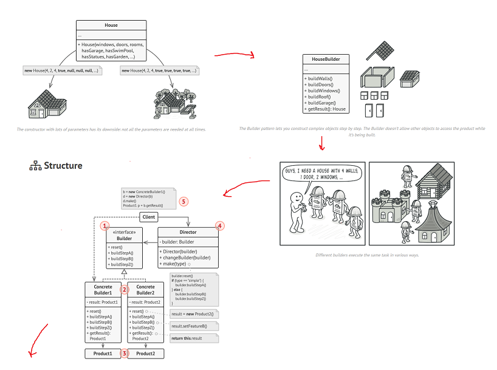

Desing Patterns that are typically split into three categories

- Creational Patterns
- Structural Patterns
  - Concerned with the structure
  - Many patters that are wrappers that mimic the underlying class interface
  - Stress the importance of good API design
- Behavioral Patterns
  - They are all different, no central theme.

### Builder Pattern



Some objects are simple and can be created in a single initializer call.
- Other objects require a lot of ceremony to create
- Having an object with 10 initializer arguments is not productive.
- Builder provides an API for it. 
- For complicated Construction of something.

### Builder Facets

Check into the example provided:


<details>
<summary>
Builder with Facets Example:

Features:

- This example you could implement it like this:


```python

if __name__ == '__main__':
    pb = PersonBuilder()
    p = pb\
        .lives\
            .at('123 London Road').in_city('London').with_postcode('SW12BC').in_city('Peru')\
        .works\
            .at('Fabrikam')\
            .at('asd')\
            .as_a('Engineer')\
            .earning(123000)\
        .build()
    print(p)
    person2 = PersonBuilder().build()
    print(person2)
```

</summary>

```python
class Person:
    def __init__(self):
        print('Creating an instance of Person')
        # address
        self.street_address = None
        self.postcode = None
        self.city = None
        # employment info
        self.company_name = None
        self.position = None
        self.annual_income = None

    def __str__(self) -> str:
        return f'Address: {self.street_address}, {self.postcode}, {self.city}\n' +\
            f'Employed at {self.company_name} as a {self.postcode} earning {self.annual_income}'


class PersonBuilder:  # facade
    def __init__(self, person=None):
        # If is not started, then we can create a new person
        if person is None:
            self.person = Person()
        else:
            # Or we can allow the edition of a builder.
            self.person = person

    @property
    def lives(self):
        return PersonAddressBuilder(self.person)

    @property
    def works(self):
        return PersonJobBuilder(self.person)

    def build(self):
        return self.person


class PersonJobBuilder(PersonBuilder):
    def __init__(self, person):
        super().__init__(person)

    def at(self, company_name):
        # The buildings of company_name
        self.person.company_name = company_name
        return self

    def as_a(self, position):
        # The biuld settings of the position.
        self.person.position = position
        return self

    def earning(self, annual_income):
        # The eearnings settings of the Person builder.
        self.person.annual_income = annual_income
        return self


class PersonAddressBuilder(PersonBuilder):
    def __init__(self, person):
        super().__init__(person)

    def at(self, street_address):
        self.person.street_address = street_address
        return self

    def with_postcode(self, postcode):
        self.person.postcode = postcode
        return self

    def in_city(self, city):
        self.person.city = city
        return self


if __name__ == '__main__':
    pb = PersonBuilder()
    p = pb\
        .lives\
            .at('123 London Road')\
            .in_city('London')\
            .with_postcode('SW12BC')\
        .works\
            .at('Fabrikam')\
            .as_a('Engineer')\
            .earning(123000)\
        .build()
    print(p)
    person2 = PersonBuilder().build()
    print(person2)


```

</details>


