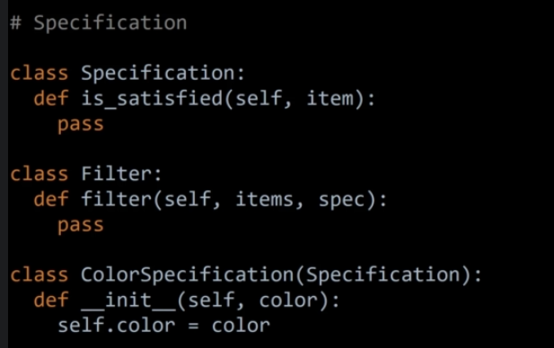

## Single Responsability Principle

```python
class Journal:
    def __init__(self):
        self.entries = []
        self.count = 0

    def add_entry(self, text):
        self.count+=1
        self.entries.append(f'{self.count}: {text}')

    def remove_entry(self, pos):
        def self.entries[pos]

    def __str__(self):
        return '\n'.join(self.entries)

    def save(self, filename):
        file = open(filename, 'w')

    def load(self, filename):
        pass

    def load_from_web(self, uri):
        pass

j = Journal()
j.add_entry('I cried today.')
j.add_entry('I ate a bug.')
print(f'Journal entries: \n{j}')

```

Should be converted to:

```py

```python
class Journal:
    def __init__(self):
        self.entries = []
        self.count = 0

    def add_entry(self, text):
        self.entries.append(f"{self.count}: {text}")
        self.count += 1

    def remove_entry(self, pos):
        del self.entries[pos]

    def __str__(self):
        return "\n".join(self.entries)

    # break SRP
    def save(self, filename):
        file = open(filename, "w")
        file.write(str(self))
        file.close()

    def load(self, filename):
        pass

    def load_from_web(self, uri):
        pass


class PersistenceManager:
    def save_to_file(journal, filename):
        file = open(filename, "w")
        file.write(str(journal))
        file.close()


j = Journal()
j.add_entry("I cried today.")
j.add_entry("I ate a bug.")
print(f"Journal entries:\n{j}\n")

p = PersistenceManager()
file = r'c:\temp\journal.txt'
p.save_to_file(j, file)

# verify!
with open(file) as fh:
    print(fh.read())

j = Journal()
j.add_entry('I cried today.')
j.add_entry('I ate a bug.')
print(f'Journal entries: \n{j}')

```

### Open Closed Principle

> When you add new functionality by extension, And it should be closed for modification. (After writting and testing it, you should extent it. (It can come with very unplosant ffeatures.))
> This absolutelly makes sense, so you don't recreate the tests.
> 2 -> 3


The Open/Closed Principle states that software entities (classes, modules, etc.) should be open for extension, but closed for modification. What does this mean, and why is it an important principle of good object-oriented design?

Open/closed principle is intended to mitigate risk when introducing new functionality. Since you don't modify existing code you can be assured that it wouldn't be broken. It reduces maintenance cost and increases product stability.

Product Filter, write test.


## Enterprice Patterns:

- Specification:

In Specification is a class that determines whether an application sastifies an criteria. Filter method, is kind of using is general. All have to do here, is providing the items to filter, the whole idea, is that you cna exten this things and inherti from this classes. 



```python

class Specification:
    def is_satisfied(self, item):
        pass

    # and operator makes life easier
    def __and__(self, other):
        return AndSpecification(self, other)


class Filter:
    def filter(self, items, spec):
        pass


class ColorSpecification(Specification):
    def __init__(self, color):
        self.color = color

    def is_satisfied(self, item):
        return item.color == self.color


class SizeSpecification(Specification):
    def __init__(self, size):
        self.size = size

    def is_satisfied(self, item):
        return item.size == self.size
```
### And Specification

This is a combinator specification And checks the lambda:

- Checks the specification is sastified, goes throught the arguments, and try to get them sastified, then the combinator is sastified. 

```python

class Specification:
    def is_satisfied(self, item):
        pass

    # and operator makes life easier
    def __and__(self, other):
        return AndSpecification(self, other)


class Filter:
    def filter(self, items, spec):
        pass


class ColorSpecification(Specification):
    def __init__(self, color):
        self.color = color

    def is_satisfied(self, item):
        return item.color == self.color


class SizeSpecification(Specification):
    def __init__(self, size):
        self.size = size

    def is_satisfied(self, item):
        return item.size == self.size


class AndSpecification(Specification):
    def __init__(self, *args):
        self.args = args

    def is_satisfied(self, item):
        return all(map(
            lambda spec: spec.is_satisfied(item), self.args))


class BetterFilter(Filter):
    def filter(self, items, spec):
        for item in items:
            if spec.is_satisfied(item):
                yield item


apple = Product('Apple', Color.GREEN, Size.SMALL)
tree = Product('Tree', Color.GREEN, Size.LARGE)
house = Product('House', Color.BLUE, Size.LARGE)

products = [apple, tree, house]

pf = ProductFilter()
print('Green products (old):')
for p in pf.filter_by_color(products, Color.GREEN):
    print(f' - {p.name} is green')

# ^ BEFORE

# v AFTER
bf = BetterFilter()

print('Green products (new):')
green = ColorSpecification(Color.GREEN)
for p in bf.filter(products, green):
    print(f' - {p.name} is green')

print('Large products:')
large = SizeSpecification(Size.LARGE)
for p in bf.filter(products, large):
    print(f' - {p.name} is large')

print('Large blue items:')
# large_blue = AndSpecification(large, ColorSpecification(Color.BLUE))
large_blue = large & ColorSpecification(Color.BLUE)
for p in bf.filter(products, large_blue):
    print(f' - {p.name} is large and blue')
```

## liskov substitution principle

Liskov Substitution Principle (LSP) states that objects of a superclass should be replaceable with objects of its subclasses without breaking the application. 

This helps us model good inheritance hierarchies. It helps us prevent model hierarchies that don't conform to the Open/Closed principle. Any inheritance model that adheres to the Liskov Substitution Principle will implicitly follow the Open/Closed principle.


## Interface Segreagation Principle

Clients should not be forced to depend upon interfaces that they do not use.
 Single Responsibility Principle, the goal of the Interface Segregation Principle is to reduce the side effects and frequency of required changes by splitting the software into multiple, independent parts.
Advantages: Doesn't  implement methods we dont need. Increases readability and maintainability of our code.

## Dependency Inversion Principle

https://www.youtube.com/watch?v=qL2-5g_lJTs

Depends on the dependency states is that high level classes should not depend on low level but on abstractions. Class with abstract methods. Swap one from the other. Advantages: gives flexibility and stability at the level of the entire architecture of your application. It will allow your application to evolve more securely and stable.
> In the same way that ceo should not double as a truck driver, Higher level clases shouldnt implement low levels classes.


